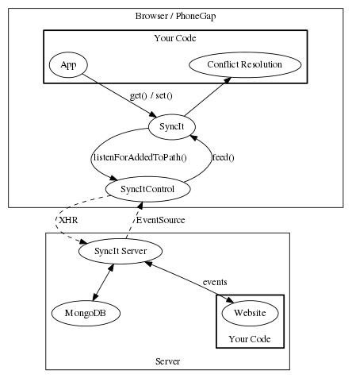
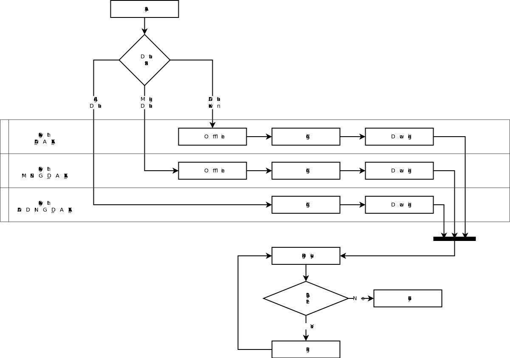

# SyncItControl

Manages SyncIt and EventSourceMonitor to hopefully produce a simple API which can help you create full SyncIt based projects, easily.

## What SyncIt does do

[SyncIt](https://github.com/forbesmyester/SyncIt) provides a way to track changes to local data and feed in data from a server, which is an essential component for building HTML5 applications that can work offline, but synchronize their data online when there is an internet connection.

## What SyncIt does not do

What SyncIt does not provide is a way to detect when an internet connection becomes available, monitoring specific datasets on the server for changes or uploading / downloading the changes to / from the server.

## What SyncItControl can do to help

It does this using the following methods:

 * Establishing a connection to the server using Server Sent Events (EventSource).
 * Downloading any changes which are on the server and feeding them into SyncIt.
 * Uploads any local changes to the server.
 * Continues to monitor for both local and remote changes so that can be applied / uploaded immediately.
 * Upon error wait for an internet connection so the process can start again.

## How does it fit into the SyncIt eco system

On the client you have Both SyncIt and SyncItControl. Your App will perform `get()` and `set()` operations on SyncIt and SyncItControl will manage uploading and downloading changes to / from the server and conflict resolution with the callback that you provide.

## How does SyncItControl Work?

SyncItControl uses EventSource to monitor an internet connection and also get messages of new data from other clients but before doing so it will perform a HTTP GET to download any data which it may have missed. It will also hook into some SyncIt events so it can detect when it needs to upload new data which it will do with a HTTP POST.

It will do all this by using a State Machine type of system which is constructed like the following:

Current State Diagram... Any state shown can go to unshown Error state, which can only lead to the Analyze state.

Analyze will end up going to either one of three states:

 1. All Dataset - If all datasets are known.
 2. Missing Dataset - If we know that we are completely lacking any of the datasets which was passed into the constructor.
 3. Adding Dataset - If all previous datasets were known but we have added one which is unknown.
	
Of these statuses Downloading in All Dataset as well as Connecting and Downloading of Adding Dataset are all classed as online and will fire the online event. Connecting and Downloading will fire the adding-new-dataset and added-new-dataset respectively.

From these statuses it will fire pushing and synced events when it enters Pushing Discovery and Synched Statuses.

## How do you use SyncItControl?

Right now the only source of information is in the [SyncItTodoMVC](https://github.com/forbesmyester/SyncItTodoMvc) source code, but there will be more complete instructions soon!

## Source Code

Source code is prepared using [Browserify](http://browserify.org/) which is also compatible with Node.JS. There is a UMD bundle which can be used with AMD or a vanilla browser (where it will export a global called called SyncItControl.
