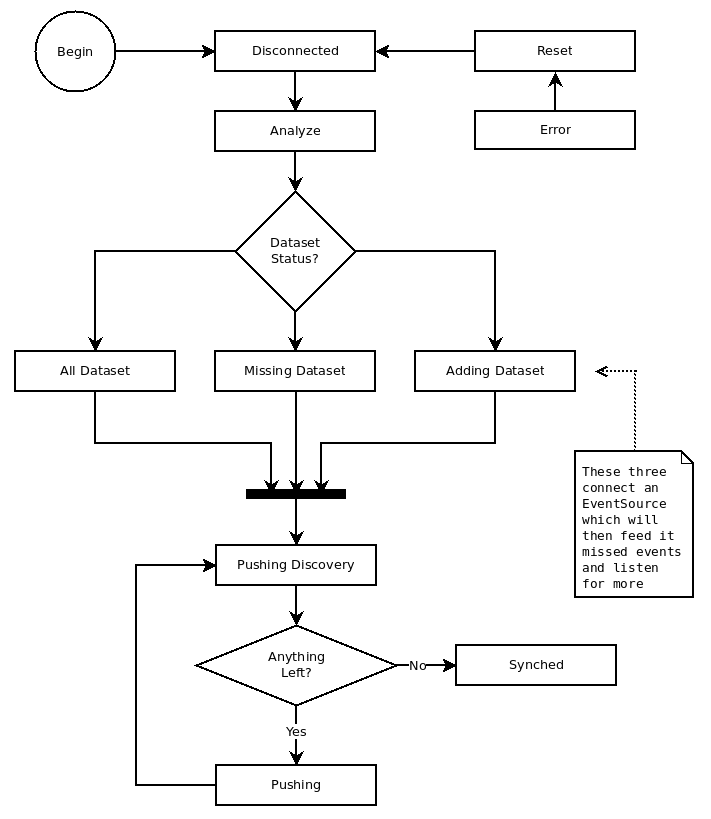

# SyncItControl

Manages SyncIt and EventSourceMonitor to hopefully produce a simple API which can help you create full SyncIt based projects, easily.

## What SyncIt does do

[SyncIt](https://github.com/forbesmyester/SyncIt) provides a way to track changes to local data and feed in data from a server, which is an essential component for building HTML5 applications that can work offline, but synchronize their data online when there is an internet connection.

## What SyncIt does not do

What SyncIt does not provide is a way to detect when an internet connection becomes available, monitoring specific datasets on the server for changes or uploading / downloading the changes to / from the server.

## What SyncItControl can do to help

It does this using the following methods:

 * Establishing a connection to the server using Server Sent Events (EventSource).
 * Downloading any changes which are on the server and feeding them into SyncIt.
 * Uploads any local changes to the server.
 * Continues to monitor for both local and remote changes so that can be applied / uploaded immediately.
 * Upon error wait for an internet connection so the process can start again.

## How does it fit into the SyncIt eco system

On the client you have Both SyncIt and SyncItControl. Your App will perform `get()` and `set()` operations on SyncIt and SyncItControl will manage uploading and downloading changes to / from the server and conflict resolution with the callback that you provide.

## How does SyncItControl Work?

SyncItControl uses EventSource to monitor an internet connection and also get messages of new data from other clients but before doing so it will perform a HTTP GET to download any data which it may have missed. It will also hook into some SyncIt events so it can detect when it needs to upload new data which it will do with a HTTP POST.

It will do all this by using a State Machine type of system which is constructed like the following:

Current State Diagram... Note that any state shown can go to Error state.

Analyze will end up going to either one of three states:

 1. All Dataset - If all datasets are known.
 2. Missing Dataset - If we know that we are completely lacking any of the datasets which was passed into the constructor.
 3. Adding Dataset - If all previous datasets were known but we have added one which is unknown.

Of these statuses Downloading in All Dataset as well as Connecting and Downloading of Adding Dataset are all classed as online and will fire the online event. Connecting and Downloading will fire the adding-new-dataset and added-new-dataset respectively.

From these statuses it will fire pushing and synced events when it enters Pushing Discovery and Synched Statuses.

## How do you use SyncItControl?

There are lots of components that are required to use SyncItControl... I could hide some of this complexity, and I still might but for testing purposes it is better that the be exposed.

	// A timestamp for tLIdEncodeDecoder, must be static within code as it is used
	// to generate Id's which need to be sequential.
	var tLIdEncoderDecoderTimestamp = new Date(2014, 1, 1, 1, 1, 1, 1).getTime(),

	// Create the instance of tLIdEncoderDecoder https://github.com/forbesmyester/getTLIdEncoderDecoder
	var tLIdEncoderDecoder = getTLIdEncoderDecoder(tLIdEncoderDecoderTimestamp, 2),

	// SyncLocalStorage is a wrapper around LocalStorage which is also namespaced
	// and can store structured data, is is part of the SyncIt package stored at
	// see https://github.com/forbesmyester/SyncIt.
	var SyncLocalStorage = new SyncLocalStorage(
		localStorage,
		'sic-state-' + userId,
		JSON.stringify,
		JSON.parse
	);

	// This is actually the first bit of code used from this repository.
	// StoreSequenceId is used to record what point we should be requesting data
	// from and it does this by buffering writes until SyncItControl is Synced.
	var storeSequenceId = new StoreSequenceId(
		stateConfig,
		tLIdEncoderDecoder.sort
	);

	// This is an AJAX wrapper for __you__ to write, it takes a dataset name (which
	// is similar to a collection in MongoDB or a table in MySQL) as well as a
	// sequence Id (which is basically the point in time that we have data to
	// already and a callback. When you are done you should call the callback with
	// the parameters (err, queueitems, sequenceId) which are whether an error
	// occurred, the data (as an array or objects) and the sequenceId that you now
	// have all the data for.
	var downloadDatasetFunc = function(dataset, fromSequenceId, next) {
		// The callback will be used something like this, once you have the data...
		next(
			null,
			[
				{"s": "cars", "k": "BMW", "b": 0, "m": "userDevice45", "r": null,
				"u": { "color": "Blue" }, "o": "update"}
			],
			"538097c4a749525c12eb987e"
		);
	};

	// When SyncItControl needs to upload data because SyncIt has told it that there
	// is some this function will be called with one Queueitem (see SyncIt) and a
	// callback function. That callback function should be called with two
	// parameters which are whether an error has occurred and the sequenceId which
	// the data was added as.
	var uploadChangeFunc = function(queueitem, next) {
		next(null, "537f81cea749525c12eb986a");
	};

	// We need an EventSourceMonitor so SyncItControl can monitor the connection
	// and be notified of new data. Note that in this instance I choose to use an
	// array instead of a URL for the initial connection (second parameter), this
	// is valid (and required by SyncItControl) because the Factory that creates
	// the EventSource (first parameter) is expecting it. See
	// https://github.com/forbesmyester/eventsource-monitor for more information.
	var eventSourceMonitor = new EventSourceMonitor(
		function(datasets) {
			var url = baseUrl +
				'/sync/' +
				deviceId +
				'?dataset[]=' +
				datasets.sort().join(
					'&dataset[]='
				);
			return new EventSource(url);
		},
		[]
	);

	// Lastly before creating an instance of SyncItControl we need to supply a
	// function that will take care of resolving conflicts when they occur. This
	// is required because SyncItControl will be the one calling SyncIt.feed()
	// when new data is supplied via downloadDatasetFunc() or from the
	// EventSourceMonitor. This is a perfectly acceptable implementation which
	// just takes the latest timestamp (as supplied by the client), but depending
	// on your app it might make sense to write your own. See the documentation
	// for SyncIt.feed() for more information.
	var conflictResolutionFunction = function(
		dataset,
		datakey,
		storedrecord,
		localChanges,
		remoteChanges,
		resolved
	) {
		var lastRemoteTs = null,
			lastLocalTs = null;

		remoteChanges.map(function(c) { lastRemoteTs = c.t; });
		localChanges.map(function(c) { lastLocalTs = c.t; });

		if (lastLocalTs > lastRemoteTs) {
			return resolved(true, localChanges);
		}

		return resolved(true,[]);
	};

	var syncItControl = new SyncItControl(
		syncIt, // An instance of SyncIt (see https://github.com/forbesmyester/SyncIt)
		eventSourceMonitor,
		storeSequenceId,
		downloadDatasetFunc,
		uploadChangeFunc,
		conflictResolutionFunction
	);

Phew! After all that we should see how we use it SyncItControl with SyncIt. Firstly you would continue to use SyncIt exactly as before, except that you would probably never have a need to call SyncIt.feed() again.

	syncIt.set('cars', 'Subaru', { "Seats": "Leather" }, function(err,result) {
		if (err) {
			// Something went wront... throw?
		}
		alert("The data stored in cars.subaru has been updated"
	});
	syncIt.get('cars', 'Subaru', function(err,result) {
			if (err) {
				// Something went wront... throw?
			}
			console.log(
				'The data stored in cars.subaru is: ' +
				JSON.stringify(result)
			);
		}
	);

It maybe that due to user interaction or new information from elsewhere that you want to also use SyncIt / SyncItControl with extra datasets... This is as easy as calling SyncItControl.addMonitoredDataset(). The first parameter is the name of the dataset to add and the second is a callback when it is ready for use.

	syncItControl.addMonitoredDataset('boats', function() {
		console.log("The 'boats' dataset is now ready for use");
	});

The only other thing you may well need to do is watch for when the state of SyncIt entered "disconnected", in which case you will probably want to try and reconnect, at least if the browser reports that there is a data connection. In this situation I am taking the easy way out and attempting to reconnect 10 seconds later!

	syncItControl.on('entered-state', function(state) {
		if (state === 'disconnected') {
			setTimeout(function() {
				syncItControl.connect();
			}, 10000);
		}
	});

## Source Code

Source code is prepared using [Browserify](http://browserify.org/) which is also compatible with Node.JS. There is a UMD bundle which can be used with AMD or a vanilla browser (where it will export a global called called SyncItControl.
